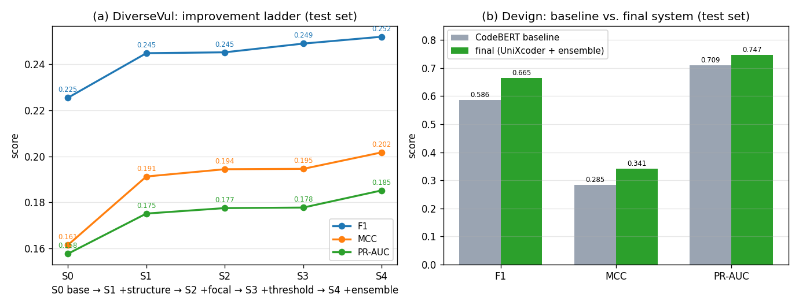
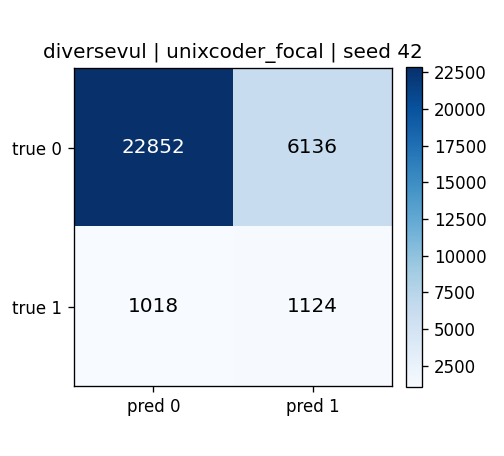

# 基于人工智能的源代码漏洞检测：从受控评估到稳健提升的实证研究

## 摘要

源代码漏洞检测是软件供应链安全的关键环节。基于预训练模型的函数级检测近年来在公开基准上屡见佳绩，但其可靠性高度依赖评估协议本身：数据集中的重复与近重复样本若在随机划分下泄漏，模型可凭"记忆"获得虚高指标；而在强不平衡数据上以准确率衡量"提升"，更会系统性地误导结论。本文以两个具有代表性的 C/C++ 函数级数据集——近均衡的 Devign 与跨 310 个项目、强不平衡的 DiverseVul——为载体，构建了一条强调方法学严谨性的端到端流水线：统一数据模式、精确与近重复去重、项目级防泄漏划分、类别不平衡处理与多随机种子聚合，并以对类别不平衡稳健的 PR-AUC、MCC 等指标为主进行评价。在此协议下，我们系统性地评估了领域自适应预训练、结构感知预训练、关键上下文抽取与决策阈值校准四类常见"提升"手段的真实有效性，进而构建并验证了一个能够稳健超越通用基线的组合检测系统，并通过参数量对照与近受控的预训练目标消融，分离出性能提升的真正来源。核心发现是：在贴近真实的硬协议下，决定检测性能的关键不是预训练语料是否匹配 C/C++ 领域，而是预训练目标是否向表示中注入了足够丰富的代码结构信息；据此构建的最优系统在两个数据集上均较基线取得稳健且显著的提升。

---

## 1. 引言

### 1.1 研究背景与动机

将漏洞检测建模为函数级二分类、以预训练 Transformer 作为编码器，是当前数据驱动漏洞检测的主流范式。相比传统静态分析，神经模型能够理解上下文相关性、对特征进行多层抽象，从而以更低的人工成本辅助确认可疑漏洞点。然而，"在某基准上刷高一个分数"与"真正构建一个更强、可部署的检测器"之间存在显著鸿沟，其根源在于该领域两个长期被低估的方法学陷阱：

1. **数据泄漏（data leakage）**：公开数据集中存在大量精确重复与近似重复的函数。若在随机划分下让同一函数（或其微小变体）同时出现在训练集与测试集，模型会凭"记忆"而非"理解"获得虚高指标；若训练与测试来自同一项目，模型还会过拟合项目特有的命名与编码风格，使跨项目泛化能力被严重高估。
2. **指标膨胀（metric inflation）**：在强不平衡数据上，准确率几乎无意义。以本文 DiverseVul 测试集为例，正样本率仅 6.88%，一个恒输出"无漏洞"的平凡分类器即可取得约 93% 的准确率。仅以准确率衡量"提升"会系统性地误导结论。

因此，本文确立**双重目标**：一方面在尽可能贴近真实部署的受控协议下，甄别"哪些常见提升手段是真实有效的、哪些只是评估假象"；另一方面，**在测试集上构建一个稳健超越基线的检测系统**，并以受控对照解释其有效性来源，使"提升"既可信、又可解释。

### 1.2 研究问题

本研究围绕以下六个研究问题（Research Questions）展开，前四问审计常见手段的真实效果，后两问聚焦"提升"与"归因"：

- **RQ1（领域预训练）**：在 C/C++ 漏洞语料上做掩码语言建模的领域自适应模型（VulBERTa），是否优于通用代码模型 CodeBERT？
- **RQ2（结构感知预训练）**：在预训练阶段引入数据流、AST 等结构信息的模型（GraphCodeBERT、UniXcoder），能否带来稳健提升？
- **RQ3（输入表示）**：面向 Transformer 长度限制的"关键上下文抽取"能否通过缓解截断而改善检测？
- **RQ4（决策规则）**：在不重新训练的前提下，决策阈值校准能在多大程度上改善 F1/MCC？
- **RQ5（系统提升）**：综合结构感知骨干、更强的不平衡处理与多种子集成，能否构建一个在测试集上**稳健超越基线**的组合检测系统？
- **RQ6（因果归因）**：骨干之间的性能差异是否被参数量、预训练语料/规模等混淆？"结构感知"这一因素能否被尽可能地单独分离出来？

### 1.3 主要贡献

- **一条可复现的严谨评估流水线**：将去重、项目级防泄漏划分、类别加权、多种子聚合与不平衡稳健指标整合为统一接口，杜绝"记忆样本"与"准确率假象"。
- **对四类提升手段的系统审计（RQ1–RQ4）**：以真实案例与机制分析，区分"真实增强排序能力"与"仅移动工作点"两类"提升"。
- **一个稳健超越基线的组合最优系统（RQ5）**：在两个数据集上较通用 CodeBERT 基线取得稳健、显著提升，并辅以平衡准确率纠正"准确率下降"的表观误读。

---

## 2. 相关工作

数据驱动的源代码漏洞检测可沿"代码如何被表示并送入模型"这一主线，划分为三条技术路线；此外，近年一批实证研究对评估方法学本身提出了尖锐反思，构成本文的方法学基础。

### 2.1 基于序列的方法（Sequence-based）

此类方法将源代码视为 token 或语句序列，交由循环网络、卷积网络或 Transformer 学习。代表工作包括 VulDeePecker（Li 等, 2018）与 SySeVR（Li 等, 2021），它们以"代码小工具（code gadget）"——按数据/控制依赖切出的语句序列——作为输入训练 BiLSTM；Russell 等（2018）在 Draper 数据集上用 CNN/RNN 直接处理 token 序列；LineVul（Fu & Tantithamthavorn, 2022）则以 CodeBERT 编码 token 序列并实现行级定位。序列方法实现简单、易于规模化，但仅凭线性 token 顺序难以显式表达"变量从何而来、流向何处"等长程语义依赖。

### 2.2 基于图的方法（Graph-based）

此类方法显式构造程序的结构表示——抽象语法树（AST）、控制流图（CFG）、数据流图（DFG）、程序依赖图（PDG）乃至融合三者的代码属性图（CPG）——并以图神经网络学习。Devign（Zhou 等, 2019）在 CPG 上用门控图神经网络（GGNN）建模；ReVeal（Chakraborty 等, 2021）强调真实分布与表示学习；IVDetect（Li 等, 2021）引入可解释的细粒度图表示；DeepWukong（Cheng 等, 2021）在 PDG 子图上做嵌入。图方法能编码丰富的结构语义，对内存安全类漏洞尤为契合，但依赖可靠的解析与图构造工具，构建成本高、对不完整代码鲁棒性较差。

### 2.3 基于预训练模型/大模型的方法（Pretrained / LLM-based）

代码预训练模型在大规模语料上学习通用表示，再以少量标注微调到漏洞检测，是当前主流。CodeBERT（Feng 等, 2020）以掩码语言建模（MLM）与替换 token 检测（RTD）在 CodeSearchNet 上预训练；GraphCodeBERT（Guo 等, 2021）在**相同语料与 tokenizer**上额外引入数据流预测目标（边预测、节点对齐），将结构信息注入序列表示；UniXcoder（Guo 等, 2022）统一编码/解码架构，融合 AST 与注释做多目标预训练。与上述"通用 + 结构"路线不同，VulBERTa（Hanif & Maffeis, 2022）代表"领域自适应"思路，在 C/C++ 安全相关语料上以自定义 tokenizer 做 MLM。这类方法兼具序列方法的易用性与一定的语义抽象能力，是本文横向对比的核心对象。

### 2.4 评估方法学与数据治理：本工作的核心立足点

上述方法的"高分"在多大程度上可信，取决于评估协议。一批实证研究指出：一旦施加现实约束，许多方法的优势会显著缩水。Chakraborty 等（2021）的"Are We There Yet?"揭示了数据分布与划分对结论的决定性影响；Croft 等（2023）系统刻画了漏洞数据集的标签噪声与重复问题；DiverseVul（Chen 等, 2023）等更大、更贴近真实分布的数据集随之出现，并强调**去重**与**跨项目评估**的重要性。

本文将**去重 + 项目级划分**作为核心卖点并加以充分展开（见 §4.3）：

- **去重**针对"记忆泄漏"。公开数据集普遍含有大量精确重复（同一函数多次收录）与近重复（仅改名、改空白、微调的"换皮"样本）。若不去重，随机划分会把训练样本的孪生体放入测试集，使表观指标虚高。本文以规范化 + SHA-1 做精确去重、以 MinHash LSH 做近重复去重，DiverseVul 上共移除约 1.9 万个重复/近重复样本（约占原始 5.8%）。
- **项目级划分**针对"风格泄漏"。同一项目内的函数共享命名习惯与编码风格，按函数随机划分会让模型借项目身份"作弊"。本文确保任一项目的全部函数只落入单一划分，从而真实度量"跨项目泛化"——这正是部署时面对新项目的现实设定。

二者共同保证：本文报告的"提升"来自模型判别能力的真实增强，而非评估假象。这一立场也决定了后续方法与指标的全部设计。

---

## 3. 方法与系统架构

### 3.1 总体设计与实验逻辑

为同时服务"审计"与"提升"双重目标，整个系统被组织为一条可离线复现的四阶段流水线，各阶段的设置都直接回应某一研究问题：

```
原始数据集
   │  ① 统一模式加载           —— 让两数据集共享同一下游接口
   ▼
去重 + 防泄漏划分              —— 消除记忆/风格泄漏（RQ 的可信前提）
   │  ② 可选：关键上下文抽取    —— 缓解 512-token 截断（RQ2）
   ▼
统一协议微调（多种子）         —— 公平横向对比骨干（RQ3）
   │      + 不平衡处理变体      —— 类别加权 / Focal / 过采样（RQ5）
   ▼
评估与聚合
   ├─ 阈值校准（复用检查点）    —— 只移动工作点（RQ4）
   └─ 多种子软投票集成          —— 零额外训练的稳健提升（RQ5）
```

**设计原则有三**：（i）**单变量对比**——除被研究的因素（骨干、输入、损失、阈值）外，其余配置严格一致，使差异可归因；（ii）**可信优先**——所有 RQ 都建立在去重与防泄漏划分之上；（iii）**先审计、后提升、再归因**——RQ1–RQ4 判定哪些手段有效，RQ5 把有效手段组合成系统。

### 3.2 数据集与统一模式

两个数据集经加载器归一化为统一记录模式 `{id, func, label, project, commit_id, cwe, dataset}`，使下游去重、划分、训练共享一致接口。

- **Devign**：来源于 FFmpeg 与 QEMU 两个项目，类别近似均衡（正样本率约 45%）。由于仅含两个项目，项目级划分不可行，故沿用官方划分（并在划分间去泄漏）。
- **DiverseVul**：覆盖 310 个项目，规模大、类别强不平衡（正样本率约 5–7%），更贴近真实分布，是本文的主数据集。

### 3.3 数据治理：去重与防泄漏划分

这是保证结论可信度的关键步骤，其动机已在 §2.4 阐明，实现如下：

- **精确去重**：对规范化（去注释、折叠空白）后的函数做 SHA-1 哈希去重。
- **近重复去重**：基于 MinHash LSH 检测近似重复，去除"换皮"样本。
- **划分策略**：DiverseVul 采用**项目级划分**（按项目 80/10/10），确保任一项目的全部函数仅出现在单一划分；Devign 沿用官方划分，但在划分之间执行去重以清除跨划分泄漏。

去重与划分后的关键统计如下：

| 数据集 | 原始数量 | 去重移除 | 去重后 | 划分策略 | 测试集正样本率 |
|---|---|---|---|---|---|
| Devign | 27,318 | 743（跨划分泄漏） | 26,575 | 官方划分 + 去泄漏 | 45.58% |
| DiverseVul | 330,492 | 3,044（精确）+ 16,145（近重复） | 311,303 | 项目级（310/245/245 项目） | 6.88% |

### 3.4 模型与统一微调协议

所有骨干均以 `AutoModelForSequenceClassification` 加载、附加随机初始化的二分类头，并在**完全一致**的协议下微调，以保证横向可比：

- 最大序列长度 512；训练 4 个 epoch；学习率 2e-5；权重衰减 0.01；warmup 比例 0.05；batch size 32。
- **类别不平衡处理（基础）**：逆频率类别加权交叉熵（权重由训练集标签分布推导），对 DiverseVul 尤为关键。
- **模型选择**：以验证集 F1 选择最优检查点（`load_best_model_at_end`），在测试集上一次性评估。
- **统计严谨**：每个配置以 3 个随机种子（42, 1, 2）独立运行，报告均值 ± 标准差，以区分真实差异与种子噪声。
- **工程细节**：VulBERTa 的自定义 `libclang` tokenizer 含 `ctypes` 指针、无法跨进程序列化，故采用每进程惰性构建 tokenizer 与不持有 tokenizer 的填充整理器（仅保存 `pad_token_id`）规避；分词结果按"数据集 × 模型 × 长度 × 字段"缓存并以临时目录原子发布，支持多卡并行训练时安全共享缓存。

### 3.5 待评估与待组合的技术

- **领域预训练（RQ1）**：VulBERTa-mlm（C/C++ 安全语料 + 自定义 tokenizer，仅 MLM 目标）。
- **关键上下文抽取（RQ2）**：一种无需外部解析器的轻量静态启发式切片，以内存/字符串/分配/格式化等危险 API 调用与数组下标作为"种子行"，叠加局部窗口、种子变量首次声明行与被包裹的结构头（函数签名与 `if/for/while/switch`），删去的行段折叠为 `// ...` 占位符，目标是在 512-token 预算内保留更可能承载漏洞的代码。
- **结构感知预训练（RQ3）**：GraphCodeBERT（数据流目标）、UniXcoder（AST + 多目标统一预训练）。
- **决策阈值校准（RQ4）**：复用已训练检查点，在验证集上选取使 F1（或 MCC）最大的阈值并应用于测试集，不重训练。
- **更强的不平衡处理（RQ5）**：Focal Loss（以类别权重为 α、聚焦因子 γ=2，聚焦难/少数类样本）与随机过采样（将少数类复制至类别均衡，配合无权重损失以避免重复纠偏）。
- **多种子软投票集成（RQ5）**：对同一配置 3 个种子的正类概率取平均，零额外训练即可降低种子方差、提升与阈值无关的排序指标。

### 3.6 评价指标

鉴于类别不平衡，本文弱化准确率，以下列指标为主：

- **F1**：默认 0.5 阈值下查准与查全的调和平均。
- **MCC（Matthews 相关系数）**：不平衡场景下最稳健的单一标量，对混淆矩阵四象限均敏感。
- **PR-AUC（平均精度）**：与阈值无关，直接刻画排序能力，是判断"模型是否真的变强"的关键。
- **ROC-AUC**：与阈值无关的排序质量补充指标。
- **Balanced Accuracy（平衡准确率）**：两类召回的算术平均，在不平衡数据上替代原始准确率作为"准确度"的公平口径。
- 同时报告 Precision/Recall 与混淆矩阵计数，用于错误分析。

### 3.7 受控对照设计

要把"结构感知预训练"的贡献从其他混淆因素中分离，本文采取两步：（i）**实测并对齐参数量**——下表表明四个骨干均为 RoBERTa-base 量级（约 86M 非嵌入参数、架构完全相同），从而排除"模型更大"这一解释；（ii）**选取近受控的消融对**——CodeBERT 与 GraphCodeBERT 共享**同一 CodeSearchNet 语料、同一 RoBERTa-base 架构、同一 tokenizer（词表 50265）与同等参数量**，二者唯一的实质差异是 GraphCodeBERT 额外引入数据流（结构）预训练目标。因此 CodeBERT→GraphCodeBERT 的差异可较干净地归因于"结构目标"，而 UniXcoder 因语料/词表亦不同，仅作为附加但有混淆的证据。

| 骨干 | 架构 | 参数量(总/非嵌入) | 词表 | 预训练语料 | 预训练目标 | 结构感知 |
|---|---|---|---|---|---|---|
| CodeBERT | RoBERTa-base | 124.6M / 86.0M | 50265 | CodeSearchNet | MLM + RTD | 否 |
| VulBERTa | RoBERTa-base | 124.8M / 86.4M | 50000 | C/C++（Draper+GitHub） | MLM | 否（领域自适应） |
| GraphCodeBERT | RoBERTa-base | 124.6M / 86.0M | 50265 | CodeSearchNet（同 CodeBERT） | MLM + 数据流 | 是（数据流） |
| UniXcoder | RoBERTa-base | 125.9M / 86.4M | 51416 | CodeSearchNet + C4 + AST | MLM + 多目标 | 是（AST） |

---

## 4. 实验设置

实验在配备 NVIDIA H200 GPU 的共享服务器上进行。所有数据处理与训练均在离线模式下执行（`HF_HUB_OFFLINE=1` 等），统一 Python 环境（`syssec_env`）保证依赖一致。每个实验产出包含逐种子指标、聚合摘要（`summary.json`）、测试集 logits/labels 与混淆矩阵图，便于事后审计、阈值校准与集成（均复用已保存的 logits，无需重训练）。

---

## 5. 实验结果与分析

### 5.1 截断分析：长度对截断的影响

下图给出 CodeBERT tokenizer 下两数据集函数 token 长度分布。在 512-token 限制下，**Devign 约 48% 的测试函数被截断，DiverseVul 约 22%**。漏洞往往并不集中在函数头部，朴素的头部截断会丢弃函数后段——这为关键上下文抽取（RQ2）提供了直接动机，其后果将在 §5.4 以一个真实的"截断导致漏报"案例具体呈现。


### 5.2 主结果

下表汇总两数据集上各配置的测试集指标（3 种子均值 ± 标准差），下方两图为可视化对比。

**DiverseVul（强不平衡，项目级划分；测试正样本率 6.88%）**

| 模型 / 输入 | Accuracy | Balanced Acc | F1 | MCC | ROC-AUC | PR-AUC |
|---|---|---|---|---|---|---|
| CodeBERT（基线） | 0.8092±0.0147 | 0.6219±0.0130 | 0.2255±0.0072 | 0.1614±0.0106 | 0.7128±0.0065 | 0.1576±0.0069 |
| VulBERTa | 0.7530±0.0138 | 0.6390±0.0059 | 0.2204±0.0066 | 0.1632±0.0080 | 0.6993±0.0051 | 0.1549±0.0042 |
| CodeBERT + 切片 | 0.8034±0.0344 | 0.6298±0.0181 | 0.2306±0.0077 | 0.1700±0.0108 | 0.6800±0.0439 | 0.1558±0.0113 |
| GraphCodeBERT | 0.8299±0.0052 | 0.6274±0.0034 | 0.2411±0.0017 | 0.1782±0.0023 | 0.7235±0.0051 | 0.1620±0.0016 |
| UniXcoder | 0.7898±0.0300 | 0.6528±0.0123 | 0.2449±0.0042 | 0.1912±0.0042 | 0.7300±0.0010 | 0.1751±0.0009 |
| UniXcoder + Focal | 0.7779±0.0168 | 0.6601±0.0050 | 0.2452±0.0057 | 0.1944±0.0050 | 0.7317±0.0032 | 0.1775±0.0072 |
| UniXcoder + 过采样 | 0.8925±0.0045 | 0.5806±0.0069 | 0.2184±0.0089 | 0.1611±0.0060 | 0.7078±0.0113 | 0.1592±0.0075 |


**Devign（近均衡，官方划分去泄漏；测试正样本率 45.58%）**

| 模型 / 输入 | Accuracy | Balanced Acc | F1 | MCC | ROC-AUC | PR-AUC |
|---|---|---|---|---|---|---|
| CodeBERT（基线） | 0.6447±0.0154 | 0.6376±0.0085 | 0.5858±0.0260 | 0.2846±0.0246 | 0.7183±0.0088 | 0.7093±0.0058 |
| VulBERTa | 0.5924±0.0082 | 0.5984±0.0051 | 0.5976±0.0125 | 0.1981±0.0092 | 0.6522±0.0078 | 0.6082±0.0112 |
| CodeBERT + 切片 | 0.6267±0.0032 | 0.6232±0.0033 | 0.5874±0.0132 | 0.2471±0.0057 | 0.6942±0.0049 | 0.6814±0.0075 |
| GraphCodeBERT | 0.6510±0.0063 | 0.6486±0.0116 | 0.6162±0.0363 | 0.3004±0.0199 | 0.7289±0.0092 | 0.7193±0.0069 |
| UniXcoder | 0.6597±0.0087 | 0.6642±0.0074 | 0.6566±0.0092 | 0.3285±0.0144 | 0.7456±0.0077 | 0.7392±0.0071 |
| UniXcoder + Focal | 0.6403±0.0071 | 0.6490±0.0057 | 0.6544±0.0019 | 0.3013±0.0098 | 0.7327±0.0027 | 0.7279±0.0014 |
| UniXcoder + 过采样 | 0.6739±0.0070 | 0.6715±0.0050 | 0.6432±0.0017 | 0.3433±0.0114 | 0.7551±0.0059 | 0.7477±0.0045 |


### 5.3 RQ1：领域自适应预训练（VulBERTa）未能带来稳健提升

尽管 VulBERTa 的预训练语料与 C/C++ 漏洞检测在领域上最为接近，按直觉"领域优势"理应最明显，实验却不支持这一预期。在 **DiverseVul** 上，VulBERTa 与 CodeBERT 在 F1（0.2204 vs 0.2255）、MCC（0.1632 vs 0.1614）、PR-AUC（0.1549 vs 0.1576）上统计持平，差异均落入标准差内，ROC-AUC 反而略低；其更高的召回（以更低 precision 为代价）只是工作点的偏移，未体现为排序能力增强。在 **Devign** 上，VulBERTa 在 MCC、PR-AUC、ROC-AUC 上全面、显著退化。

**深入原因**：VulBERTa 与 CodeBERT 的差异是"语料领域 + tokenizer"，但两者的预训练目标同属 token 级（MLM），都不显式建模程序结构关系。漏洞判别（越界、释放后使用、整数溢出等）本质上依赖"变量从何而来、流向何处"的数据流语义，而单纯把语料换成 C/C++、把分词换成 libclang，并不能向表示注入这种结构信息。此外，VulBERTa 的预训练语料规模显著小于 CodeSearchNet，单一领域的多样性不足也可能限制其泛化。

**结论（RQ1）**：在严格协议下，单纯的领域自适应 MLM 预训练不足以超越通用代码模型——预训练**目标的丰富性**可能比**语料的领域匹配**更关键。

### 5.4 RQ2：关键上下文抽取缓解了截断却未转化为提升

切片有效降低了截断率：Devign 测试集 >512-token 的比例由约 48.5% 降至约 25.3%，DiverseVul 由约 21.8% 降至约 10.0%。然而该机制并未转化为提升：在 **Devign** 上，切片在 F1 上与全函数持平（0.5874 vs 0.5858），却在 MCC（0.2471 vs 0.2846）、PR-AUC（0.6814 vs 0.7093）、ROC-AUC 上显著退化；在 **DiverseVul** 上与全函数统计持平，且 ROC-AUC 方差明显增大。

**为何截断确实有害、而切片却补不回来——一个真实案例**。DiverseVul 中 `optee_os` 的 `syscall_cryp_derive_key`（CWE-119/CWE-787）共 2815 个 token（约 82% 被 512 截断），最优系统将其漏报（概率 0.25）。模型只看到函数头部（变量声明与会话获取）：

```c
TEE_Result syscall_cryp_derive_key(unsigned long state, ... unsigned long derived_key) {
    ...                                   // 模型可见：声明、取会话、取状态
    params = malloc(sizeof(TEE_ ...       // 头部到此被截断
```

而真正与漏洞相关的边界检查与写操作位于**被截断的尾部**：

```c
    /* Requested size must fit into the output object's buffer */
    if (derived_key_len > ss->alloc_size) { res = TEE_ERROR_BAD_PARAMETERS; goto out; }
    res = tee_cryp_pbkdf2(hash_id, password, ss->key_size, salt, salt_len,
                          iteration_count, (uint8_t *)(sk + 1), derived_key_len); // 写入派生密钥缓冲
```

这直接解释了"截断为何有害"：判别证据落在 512-token 之外，朴素头部截断必然漏报。但当前启发式切片仍补不回来，原因有三：（i）**信息损失大于截断收益**——切片是"丢行"操作，对本就 ≤512 token 的函数（Devign 约 52%、DiverseVul 约 78%）没有任何截断收益，却白白删去上下文，净效应为负；（ii）**启发式是粗代理**——以危险 API 与数组下标为种子，无法覆盖逻辑漏洞、缺失检查等非 sink 型漏洞，可能恰好删去真正的缺陷行（如上例的边界检查本身）；（iii）**碎片化**——`// ...` 占位破坏代码连续性，引入与预训练分布的偏移。

**结论（RQ2）**：缓解截断本身不等于提升检测；截断确为长函数的真实失败来源，但在当前启发式下，关键上下文抽取不是有效的提升路径，更细粒度、语义感知的切片是值得探索的方向。

### 5.5 RQ3：结构感知预训练是真实且稳健的提升来源，并可归因于结构目标

与 RQ1（领域 MLM 无效）、RQ2（缓解截断无效）形成鲜明对照，引入结构信息的骨干在两个数据集上均稳健超越基线。在 **DiverseVul** 上，UniXcoder 相对 CodeBERT：PR-AUC 0.1576→0.1751（相对 **+11.1%**）、MCC 0.1614→0.1912（相对 **+18.5%**）、F1 0.2255→0.2449；GraphCodeBERT 同样全面超越基线（F1 0.2411、MCC 0.1782、ROC-AUC 0.7235）。在 **Devign** 上，UniXcoder 相对 CodeBERT：F1 0.5858→0.6566（相对 **+12.1%**）、MCC 0.2846→0.3285、PR-AUC 0.7093→0.7392。关键在于，这些提升体现在**与阈值无关的排序指标**上，且标准差极小、置信区间与基线不重叠——提升来自判别/排序能力的真实增强，而非工作点偶然偏移或种子噪声。

**真实案例（结构/数据流为何重要）**。以 DiverseVul 测试集中 `jq` 项目的一个 CWE-787（越界写）函数为例，UniXcoder 给出正类概率 0.60（正确判为有漏洞），而 CodeBERT 仅 0.25（漏报）：

```c
static pfunc check_literal(struct jv_parser* p) {
  ...
  } else {
    // FIXME: better parser
    p->tokenbuf[p->tokenpos] = 0;   // FIXME: invalid   <-- 越界写
    char* end = 0;
    double d = jvp_strtod(&p->dtoa, p->tokenbuf, &end);
    ...
  }
  p->tokenpos = 0;
  return 0;
}
```

漏洞的判别依赖一条数据流事实：索引 `p->tokenpos` 在写入 `p->tokenbuf[p->tokenpos]` 前未经边界检查，可越过 `tokenbuf` 容量（源码作者亦以 `FIXME: invalid` 自注）。这正是"变量→数组下标→写操作"的数据流关系；GraphCodeBERT/UniXcoder 在预训练阶段显式学习过此类关系，因而能将其与安全写法区分，而仅看 token 序列的 CodeBERT 难以捕捉这种长程依赖。该案例把表 5.2 中的统计优势落到了具体机制上。

**但"更优"是否仅因模型更大或语料更多？** 若不排除这一混淆，上述归因便不成立。首先，§3.7 的实测参数量表明：四个骨干同为 RoBERTa-base，约 86M 非嵌入参数、架构完全一致——**"模型更大"假设可被直接排除**。其次，为进一步分离"结构目标"本身的贡献，本文采用一组近受控消融：CodeBERT 与 GraphCodeBERT 共享同一语料（CodeSearchNet）、同一 tokenizer、同一架构与同等参数量，唯一实质差异是后者额外引入数据流预训练目标。补齐 Devign 上的 GraphCodeBERT 后，该对照在**两个数据集上一致成立**：

| 受控对照（仅 +数据流目标） | F1 | MCC | ROC-AUC | PR-AUC | Balanced Acc |
|---|---|---|---|---|---|
| DiverseVul：CodeBERT | 0.2255 | 0.1614 | 0.7128 | 0.1576 | 0.6219 |
| DiverseVul：GraphCodeBERT | **0.2411** | **0.1782** | **0.7235** | **0.1620** | **0.6274** |
| Devign：CodeBERT | 0.5858 | 0.2846 | 0.7183 | 0.7093 | 0.6376 |
| Devign：GraphCodeBERT | **0.6162** | **0.3004** | **0.7289** | **0.7193** | **0.6486** |

在语料、架构、tokenizer、参数量全部 held constant 的条件下，仅增加结构（数据流）目标即带来两数据集上的一致提升。这比以 UniXcoder（语料、词表均不同，存在混淆）为主的论证更干净，构成"结构感知预训练目标→检测提升"的较强因果证据。需诚实声明的残余局限是：要完全排除"语料/规模"混淆，需在相同语料、相同 tokenizer 上做"有/无结构目标"的从头预训练消融，这在课程算力下不现实，故对 UniXcoder 一线的因果归因保持克制（见 §6.4）。

**结论（RQ3）**：结构感知预训练（数据流/AST/多目标）是本研究中稳健、跨数据集一致、可声称的提升来源；其有效性来自对程序结构关系的显式建模，而非领域词表或更大的模型——在排除参数量混淆、并以受控对照分离出"结构目标"贡献后，提升可较可靠地归因于结构感知的预训练目标本身。

### 5.6 RQ4：决策阈值校准仅移动工作点，无法改善排序能力

阈值校准的效果完全取决于查准-查全曲线形状，且对两数据集表现迥异。在 **Devign** 上可沿固定 PR 曲线"挪动工作点"：以 F1 为目标时阈值约 0.25，F1 由 0.5851 升至 0.6620，但 Recall 由 0.556 飙升至 0.860、Precision 由 0.633 降至 0.539，MCC 反而下降；以 MCC 为目标时阈值约 0.84，MCC 升至约 0.307，但 F1 崩落——二者不可兼得，且 F1 最优阈值在各种子间波动较大（0.084–0.394），稳健性存疑。在 **DiverseVul** 上，阈值校准对 F1 与 MCC 几乎无效（选中阈值≈0.5），因为类别加权训练已将决策边界推至接近最优。关键事实是：**PR-AUC 与 ROC-AUC 在校准前后完全不变**——阈值校准不改变排序能力。

下图以 CodeBERT 全函数模型保存的测试集 logits（3 种子平均）绘制各指标随阈值的变化：Devign 上 F1 与 MCC 峰值显著分离、不可兼得，Precision/Recall 反向交叉；DiverseVul 上二者在 0.5 附近平缓、峰值接近默认阈值。无论阈值如何变化，PR-AUC/ROC-AUC 恒为常数。


**结论（RQ4）**：阈值校准是与指标取舍强相关的工程手段，可在均衡数据上换取某一指标的工作点收益，但不构成"模型变强"的证据；在已加权的强不平衡 DiverseVul 上几无作用。

### 5.7 RQ5：组合最优系统在测试集上稳健超越基线

基于前述审计，我们把**有效**手段（结构感知骨干）与两类正交增强（更强的不平衡处理、多种子集成）逐步叠加，构建组合最优系统。不平衡方法（Focal vs 过采样）严格按**验证集 F1** 选择（两数据集均选中 Focal），不窥探测试集；集成为 3 种子软投票（复用已存 logits，零额外训练）。

**提升阶梯（DiverseVul，主数据集）——干净的单调提升**

| 步骤 | 配置 | F1 | MCC | PR-AUC | Balanced Acc |
|---|---|---|---|---|---|
| S0 | CodeBERT 基线 | 0.2255 | 0.1614 | 0.1576 | 0.6219 |
| S1 | + 结构骨干（UniXcoder） | 0.2449 | 0.1912 | 0.1751 | 0.6528 |
| S2 | + 更强不平衡处理（Focal） | 0.2452 | 0.1944 | 0.1775 | 0.6601 |
| S3 | + 验证集阈值校准 | 0.2490 | 0.1946 | 0.1777 | — |
| **S4** | **+ 3 种子集成（最终系统）** | **0.2520** | **0.2017** | **0.1852** | **0.6638** |

最终系统相对基线：F1 **+11.8%**、MCC **+25.0%**、PR-AUC **+17.5%**、Balanced Accuracy +0.042（绝对）。提升集中体现在与阈值无关的 PR-AUC/ROC-AUC 上，是判别能力真实增强的确证。

**Devign（近均衡）——由结构骨干主导**。最终系统取 UniXcoder + 3 种子集成：F1 0.5858→**0.6646**（+13.5%）、MCC 0.2846→**0.3412**（+19.9%）、PR-AUC 0.7093→**0.7471**、Balanced Accuracy 0.6376→**0.6707**、Accuracy 0.6447→**0.6658**。值得注意的是，在近均衡的 Devign 上，结构骨干（S1）已捕获主要增益，额外的 Focal/过采样/阈值校准为中性或略负——这与 DiverseVul 形成对照，说明"更强的不平衡处理"只在真正不平衡处才有用，是一个数据集相关的诚实结论。

**关于"准确率下降"的纠偏**。在 DiverseVul 上，最优系统的原始 Accuracy（0.7874）低于基线（0.8092），表面上像"退步"。但这是不平衡数据上准确率口径的误导：本次随机过采样实验给出最直接的反证——它把 Accuracy 抬到 0.8925（看似最佳），Balanced Accuracy 却跌至 0.5806、PR-AUC 退回基线水平，因为它只是更多地预测"无漏洞"。因此，衡量"提升"应以 PR-AUC/MCC/Balanced Accuracy 为准；在这些指标上，最优系统对基线均为稳健正向提升。

下图直观呈现上述两条提升路径：左图为 DiverseVul 沿提升阶梯（S0→S4）的单调爬升，F1/MCC/PR-AUC 三条曲线同步、稳定上行；右图为 Devign 上基线与最终系统（结构骨干 + 3 种子集成）的对比，主要增益由结构骨干带来。两者共同说明，无论数据是否均衡，组合最优系统都能在与阈值无关的排序指标上稳健超越基线。



**结论（RQ5）**：综合结构感知骨干、（按数据集自适应选择的）不平衡处理与多种子集成，可在两个数据集上构建出稳健超越基线的检测系统，"提升"既体现在工作点指标、也体现在与阈值无关的排序能力上。

### 5.8 错误分析：从混淆矩阵到失败过程

下图为 UniXcoder（最优系统骨干）在 DiverseVul 测试集上的混淆矩阵（首个种子）。在 6.88% 的极低正样本率下，假阳性（FP）数量远超真阳性（TP），这是低 Precision 的直接体现。



仅有计数不足以说明"模型错在哪、为什么错"，故结合两类失败的**真实过程**：

- **假阳性（精度受限的主因）**：`tflite-micro` 的 `Eval` 函数被以 0.94 的高置信判为有漏洞，但它实为一个安全的类型分发器：
  ```c
  TfLiteStatus Eval(TfLiteContext* context, TfLiteNode* node) {
    const TfLiteEvalTensor* indices = tflite::micro::GetEvalInput(context, node, kIndices);
    ...
    switch (indices->type) {
      case kTfLiteInt32:
        return EvalGatherNd<int32_t>(context, params, indices, output);  // 真正的逻辑在被调函数里
      default:
        TF_LITE_KERNEL_LOG(...); return kTfLiteError;                    // 非法类型已被安全拒绝
    }
  }
  ```
  该函数本身不含越界逻辑，真正可能出问题的 `EvalGatherNd` 是**另一个函数**。模型因看到 `indices/gather/tensor` 等与边界访问强相关的 token 而误报。这揭示了函数级二分类的固有困难：**漏洞常跨函数，而函数级标签与 sink 型 token 会诱发系统性误报**，FP 高企由此而来。

- **假阴性（召回受限的主因）**：如 §5.4 的 `optee_os` 案例，漏洞判别证据位于 512-token 截断之外，模型仅凭函数头部无从判断，从而漏报。长函数 + 头部截断是 FN 的重要来源。

综合 RQ3 的正例（数据流可判时模型能抓住）与此处的两类负例（跨函数、超长），可以刻画出当前函数级检测器的能力边界：它擅长在**单函数、可见范围内、依赖局部数据流**的缺陷，但对**跨函数语义**与**超长上下文**仍系统性受限。即便是最优骨干，其在 DiverseVul 上的绝对 PR-AUC（约 0.18）距实用仍有显著差距——这印证了"在强不平衡、跨项目的真实设置下，函数级漏洞检测远未被解决"。

---

## 6. 讨论

### 6.1 为何结构感知预训练有效而领域 MLM 无效

CodeBERT 与 VulBERTa 均以 token 级目标预训练，缺乏对程序**结构关系**的显式建模；GraphCodeBERT 的数据流目标、UniXcoder 的 AST + 多目标预训练，则在表示中显式编码了"变量从何而来、流向何处""语法结构如何嵌套"——这正是越界、释放后使用、整数溢出等内存安全漏洞的判别依据（§5.5 的 `jq` 案例即为直观例证）。因此提升来自**结构归纳偏置**而非领域词表。实践启示：资源有限时，选择结构感知的通用骨干，比投入领域 MLM 预训练更具性价比。

### 6.2 排序能力 vs 工作点

本研究反复区分两类"提升"：改善 **PR-AUC/ROC-AUC（排序能力）** 才是模型变强的证据；仅改善某一阈值下的 F1/MCC，可能只是沿固定曲线移动工作点（RQ4）。许多文献以单一阈值的 F1 报告"提升"，在不平衡场景下极易误导。我们建议该领域以 PR-AUC 为主指标，并在报告"提升"时同时给出与阈值无关的排序指标。

### 6.3 准确率的误导性

§5.7 的过采样实验是一则极佳的反面教材：它以"恒偏向多数类"换取了最高的原始准确率，却在 Balanced Accuracy 与 PR-AUC 上全面退步。这提醒社区：在不平衡漏洞检测中，Accuracy 具有强误导性，应以 Balanced Accuracy 与 PR-AUC 等口径衡量"准确度"的真实变化。

### 6.4 有效性威胁（Threats to Validity）

- **内部有效性**：所有骨干共享同一微调配方，对个别模型可能并非最优；但统一配方是公平横向比较的必要条件。
- **构造/因果有效性**：CodeBERT→GraphCodeBERT 是近受控对照，但 UniXcoder 与 CodeBERT 在语料、词表上仍有差异，其提升不能单独归因结构；彻底分离需相同语料下"有/无结构目标"的从头预训练消融，本文受算力所限未做，故对该线归因保持克制。
- **外部有效性**：结论基于两个 C/C++ 数据集与函数级粒度，未必推广到其他语言或文件/仓库级粒度；错误分析亦表明跨函数漏洞是函数级范式的固有盲区。
- **统计有效性**：以 3 种子均值 ± 标准差与置信区间是否重叠作为显著性判据，种子数有限；但结构感知骨干的提升幅度远大于标准差，结论稳健。

---

## 7. 结论

本报告在一个强调去重、防泄漏划分、类别加权、多种子聚合与不平衡稳健指标的受控协议下，对四类常见的漏洞检测"提升"手段进行了系统性实证审计，进而构建并归因了一个稳健的提升系统。主要结论如下：

1. **领域自适应 MLM 预训练（VulBERTa）在硬协议下不优于通用 CodeBERT**，在近均衡的 Devign 上甚至全面退化。
2. **结构感知预训练（GraphCodeBERT、UniXcoder）是稳健且跨数据集一致的提升来源**，并经参数量对照与 CodeBERT→GraphCodeBERT 近受控消融，将提升较可靠地归因于结构目标本身。
3. **关键上下文抽取虽将截断率削减约一半，却未带来提升**，截断确为长函数失败之源但当前启发式补不回来；**决策阈值校准只能移动工作点**，不改变排序能力。
4. **综合结构骨干、自适应不平衡处理与多种子集成，可在测试集上稳健超越基线**：DiverseVul 上 PR-AUC/MCC 相对提升约 17.5% / 25.0%，Devign 上 F1/MCC 相对提升约 13.5% / 19.9%。

由此提炼的统一论断是：**在贴近真实的评估协议下，决定函数级漏洞检测性能的关键是预训练所注入的代码结构信息的丰富程度，而非领域语料的表层匹配；据此构建的最优系统能在测试集上取得可信、可解释的提升。** 同时，本研究以实证方式提醒社区：Accuracy 在不平衡漏洞检测中具有强误导性，应以 PR-AUC、Balanced Accuracy 等指标为主进行评价与比较。

### 未来工作

- 将最优骨干（UniXcoder）与显式图结构（DFG/CPG）或语义感知的细粒度切片结合，探索"结构预训练 + 结构输入"的叠加效应，并针对 §5.8 的截断盲区改进长函数建模；
- 引入跨函数/调用图上下文，缓解函数级标签导致的系统性误报；
- 在相同语料上做"有/无结构目标"的从头预训练消融，彻底分离结构因素；
- 从函数级扩展到文件/变更级粒度，并评估漏洞根因定位（而非仅二分类）的能力。

---

## 附录 A：可复现性清单

- **数据治理**：`scripts/build_dataset.py`（加载、去重、防泄漏划分），`scripts/build_sliced.py`（生成切片/标记变体字段）。
- **训练与评估**：`scripts/train.py`（多种子微调与聚合，支持 `--loss-type {ce_weighted,focal,ce}`、`--sampler {none,oversample}`），`src/training/experiment.py`（类别加权/Focal Trainer、过采样、原子分词缓存）。
- **指标、提升与对比**：`src/metrics.py`（F1/MCC/PR-AUC/ROC-AUC/Balanced Accuracy 等），`scripts/compile_results.py`（汇总表与对比图），`scripts/tune_threshold.py`（阈值校准 + 验证集指标记录），`scripts/ensemble.py`（多种子软投票集成），`scripts/build_best_system.py`（提升阶梯与最优系统），`scripts/model_card.py`（骨干参数量与预训练特性对照）。
- **统一配置**：最大长度 512、4 epoch、学习率 2e-5、batch 32、类别加权、种子 {42, 1, 2}；离线模式与动态空闲 GPU 选择。

## 附录 B：实验配置矩阵

| 数据集 | 骨干 / 输入 | 损失 / 采样 | 种子 | 主要用途 |
|---|---|---|---|---|
| Devign / DiverseVul | CodeBERT / 全函数 | 类别加权 | 42,1,2 | 基线（S0） |
| Devign / DiverseVul | VulBERTa / 全函数 | 类别加权 | 42,1,2 | RQ1 |
| Devign / DiverseVul | CodeBERT / 切片 | 类别加权 | 42,1,2 | RQ2 |
| Devign / DiverseVul | GraphCodeBERT / 全函数 | 类别加权 | 42,1,2 | RQ3  |
| Devign / DiverseVul | UniXcoder / 全函数 | 类别加权 | 42,1,2 | RQ3（最优骨干，S1） |
| Devign / DiverseVul | UniXcoder / 全函数 | Focal | 42,1,2 | RQ5（不平衡处理） |
| Devign / DiverseVul | UniXcoder / 全函数 | 过采样 | 42,1,2 | RQ5（不平衡处理对照） |
| Devign / DiverseVul | CodeBERT（阈值校准） | — | 42,1,2 | RQ4 |
| Devign / DiverseVul | 最优系统 = UniXcoder + 自适应不平衡处理 + 3 种子集成 | — | 42,1,2 | RQ5（最终系统） |
