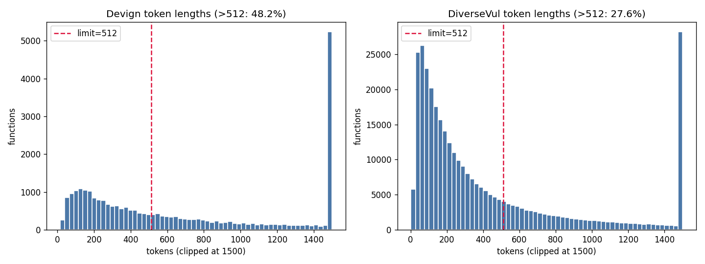
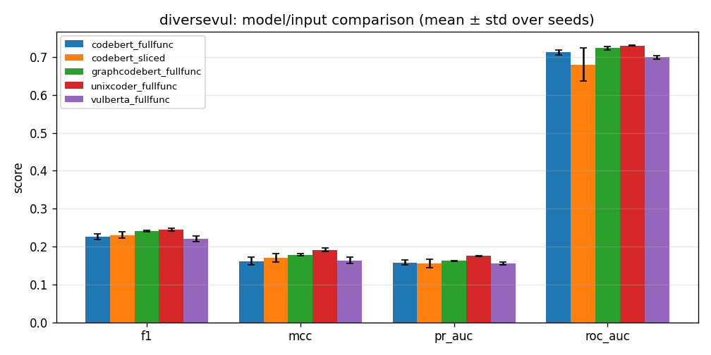
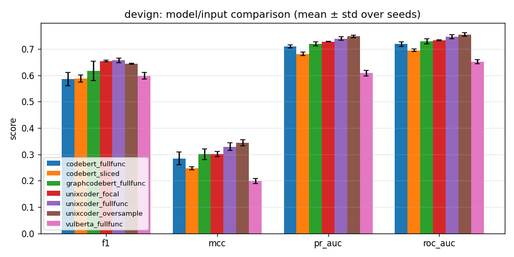
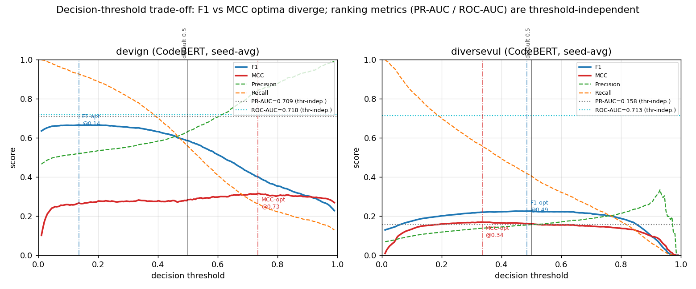
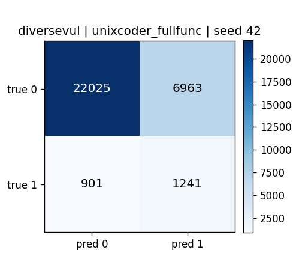

# 基于人工智能的源代码漏洞检测：一项受控实证研究

## 摘要

源代码漏洞检测是软件供应链安全的核心环节。近年来，基于预训练语言模型的函数级漏洞检测方法在多个公开基准上报告了接近"实用"的指标，但这些结论的可靠性高度依赖于评估协议本身。本报告以两个具有代表性的 C/C++ 函数级数据集 Devign（项目高度集中、类别近似均衡）与 DiverseVul（跨 310 个项目、正样本率仅约 6.9% 的强不平衡数据集）为载体，构建了一条强调**方法学严谨性**的端到端实验流水线：统一数据模式、精确与近重复去重、项目级划分以消除数据泄漏、类别加权微调、多随机种子（3 seeds）聚合，并以 F1、MCC、PR-AUC 等对类别不平衡稳健的指标为主进行评价。在此协议下，我们系统性地评估了四类"提升准确度"的技术路径：（i）领域自适应预训练（VulBERTa）；（ii）结构感知的通用代码预训练（GraphCodeBERT、UniXcoder）；（iii）面向截断问题的关键上下文抽取；（iv）决策阈值校准。

实验得到三个核心结论。**第一**，在去重与项目级划分的硬协议下，领域自适应预训练（VulBERTa）相对通用 CodeBERT 基线**未能带来稳健提升**，在 Devign 上甚至全面退化。**第二**，关键上下文抽取虽将超长函数的截断率削减约一半，却未转化为指标提升，在 Devign 上反而有害；决策阈值校准只能在固定的查准-查全曲线上移动工作点，无法改善与阈值无关的排序能力。**第三**，真正稳健且跨数据集一致的提升来自**结构感知的预训练骨干**：UniXcoder 在 DiverseVul 上将 PR-AUC 从 0.1576 提升至 0.1751（相对 +11.1%）、MCC 从 0.1614 提升至 0.1912（相对 +18.5%），在 Devign 上将 F1 从 0.5858 提升至 0.6566（相对 +12.1%）、MCC 从 0.2846 提升至 0.3285，且所有提升的标准差极小、置信区间与基线不重叠。综合来看，决定硬基准上检测性能的关键不在于"预训练语料是否匹配 C/C++ 领域"，而在于"预训练目标是否注入了足够丰富的代码结构信息"。

---

## 1. 引言

### 1.1 研究背景与动机

将漏洞检测建模为函数级二分类、并以预训练 Transformer 作为编码器，是当前数据驱动漏洞检测的主流范式。然而，该领域长期存在两个被低估的方法学陷阱：

1. **数据泄漏（data leakage）**：公开数据集中存在大量精确重复与近似重复的函数；若在随机划分下让同一函数（或其微小变体）同时出现在训练集与测试集，模型可凭"记忆"而非"理解"获得虚高指标。同时，若训练/测试来自同一项目，模型会过拟合项目特有的命名与编码风格，导致跨项目泛化能力被严重高估。
2. **指标误导（metric inflation）**：在强不平衡数据集上，Accuracy 几乎无意义——以 DiverseVul 测试集为例，正样本率仅 6.88%，一个恒输出"无漏洞"的平凡分类器即可取得约 93% 的准确率。因此，仅以 Accuracy 衡量"提升"会系统性地误导结论。

本报告的目标并非追求某个数据集上的最高分数，而是在一个**尽可能贴近真实部署**的受控评估协议下，回答"哪些常见的提升手段是真实有效的、哪些只是评估假象"这一实证问题。

### 1.2 研究问题

本研究围绕以下四个研究问题（Research Questions）展开：

- **RQ1（领域预训练）**：在 C/C++ 漏洞语料上进行掩码语言建模的领域自适应模型（VulBERTa），是否优于通用代码模型 CodeBERT？
- **RQ2（结构感知预训练）**：在预训练阶段引入数据流、AST 等结构信息的模型（GraphCodeBERT、UniXcoder），能否带来稳健提升？
- **RQ3（输入表示）**：面向 Transformer 长度限制的"关键上下文抽取"是否能通过缓解截断而改善检测？
- **RQ4（决策规则）**：在不重新训练的前提下，决策阈值校准能在多大程度上改善 F1/MCC？

---

## 2. 相关工作

数据驱动漏洞检测大致沿三条技术路线演进：（1）基于词序列的方法，将源代码视作 token 序列输入循环网络或 Transformer；（2）基于图结构的方法，利用 AST、CFG、DFG、PDG 乃至 CPG 显式编码程序语义；（3）混合表示方法，将序列与结构信息融合。预训练范式上，CodeBERT 以 MLM + 替换 token 检测在大规模代码-自然语言语料上预训练；GraphCodeBERT 进一步引入变量数据流预测任务；UniXcoder 则统一了编码器/解码器架构并融合 AST 与注释等多模态信息进行多目标预训练；VulBERTa 代表了"领域自适应"思路，在 C/C++ 安全相关语料上以自定义 tokenizer 进行 MLM 预训练。

与既有工作报告"在某基准上达到 SOTA"不同，近年来一批实证研究指出：一旦施加去重与现实划分，许多方法的优势会显著缩水。本报告在统一、严格的协议下对上述代表性骨干进行横向复核，定位真实有效的提升来源。

---

## 3. 方法与系统架构

整体流水线分为四个阶段，各阶段均可离线复现：

```
原始数据集 ──▶ ① 统一模式加载 ──▶ ② 去重 + 划分（防泄漏）
                                          │
                                          ▼
            ④ 多种子评估聚合 ◀── ③ 类别加权微调（缓存分词）
```

### 3.1 数据集与统一模式

两个数据集经加载器归一化为统一记录模式 `{id, func, label, project, commit_id, cwe, dataset}`，从而使下游去重、划分、训练共享一致接口。

- **Devign**：来源于 FFmpeg 与 QEMU 两个项目，类别近似均衡（正样本率约 45%）。由于仅含两个项目，项目级划分不具可行性，故沿用其官方划分。
- **DiverseVul**：覆盖 310 个项目，规模大、类别强不平衡（正样本率约 5–7%），是更贴近真实分布的基准。

### 3.2 数据治理：去重与防泄漏划分

这是本研究保证结论可信度的关键步骤。

- **精确去重**：对规范化（去注释、折叠空白）后的函数做 SHA-1 哈希去重。
- **近重复去重**：基于 MinHash LSH 检测近似重复，去除"换皮"样本。
- **划分策略**：
  - DiverseVul 采用**项目级划分**（80/10/10），确保任一项目的全部函数仅出现在单一划分中，从而真实度量"跨项目泛化"。
  - Devign 沿用官方划分，但在划分之间执行去重以清除跨划分泄漏。

去重与划分后的关键统计如下：

| 数据集 | 原始数量 | 去重移除 | 去重后 | 划分策略 | 测试集正样本率 |
|---|---|---|---|---|---|
| Devign | 27,318 | 743（跨划分泄漏） | 26,575 | 官方划分 + 去泄漏 | 45.58% |
| DiverseVul | 330,492 | 3,044（精确）+ 16,145（近重复） | 311,303 | 项目级（310/245/245 项目） | 6.88% |

值得注意的是，DiverseVul 共移除了约 1.9 万个重复/近重复样本（占原始约 5.8%），这部分样本若保留并在随机划分下泄漏，足以显著抬高表观指标。

### 3.3 模型与微调协议

所有骨干均以 `AutoModelForSequenceClassification` 加载、附加随机初始化的二分类头，并在相同协议下微调，以保证横向可比：

- 最大序列长度 512；训练 4 个 epoch；学习率 2e-5；权重衰减 0.01；warmup 比例 0.05；batch size 32。
- **类别不平衡处理**：采用**逆频率类别加权交叉熵**（权重由训练集标签分布推导），对 DiverseVul 尤为关键。
- **模型选择**：以验证集 F1 选择最优检查点（`load_best_model_at_end`），在测试集上一次性评估。
- **可复现与统计严谨**：每个配置以 3 个随机种子（42, 1, 2）独立运行，报告均值 ± 标准差，以区分真实差异与种子噪声。
- **工程细节**：对 VulBERTa 的自定义 `libclang` tokenizer 含 `ctypes` 指针、无法跨进程序列化的问题，采用每进程惰性构建 tokenizer 与不持有 tokenizer 的填充整理器（仅保存 `pad_token_id`）加以规避；分词结果按"数据集 × 模型 × 长度 × 字段"缓存，供多种子复用。

### 3.4 评价指标

鉴于类别不平衡，本报告以下列指标为主，弱化 Accuracy：

- **F1**：查准与查全的调和平均，反映在默认 0.5 阈值下的平衡性能。
- **MCC（Matthews 相关系数）**：在不平衡场景下最稳健的单一标量指标，对混淆矩阵四个象限均敏感。
- **PR-AUC（平均精度）**：与阈值无关，直接刻画模型在不平衡数据上的**排序能力**，是判断"模型是否真的变强"的关键。
- **ROC-AUC**：与阈值无关的排序质量补充指标。
- 同时报告 Precision/Recall 及混淆矩阵计数，用于错误分析。

### 3.5 待评估的提升策略

- **领域预训练**：VulBERTa-mlm（C/C++ 安全语料 + 自定义 tokenizer，仅 MLM 目标）。
- **结构感知预训练**：GraphCodeBERT（数据流目标）、UniXcoder（AST + 注释 + 代码多目标统一预训练）。
- **关键上下文抽取**：一种无需外部解析器的轻量静态启发式切片。以内存/字符串/分配/格式化等危险 API 调用与数组下标作为"种子行"，叠加局部窗口、种子变量的首次声明行，以及被包裹的结构头（函数签名与 `if/for/while/switch`），被删行段折叠为 `// ...` 占位符；目标是在 512-token 预算内保留更可能承载漏洞的代码。
- **决策阈值校准**：复用已训练检查点，在验证集上选取使 F1（或 MCC）最大的阈值并应用于测试集，不进行重训练。

---

## 4. 实验设置

实验在配备 NVIDIA H200 GPU 的服务器上进行。所有数据处理与训练均在离线模式下执行（`HF_HUB_OFFLINE=1` 等），确保不引入网络不确定性。统一的 Python 环境（`syssec_env`）保证依赖一致。每个实验产出包含逐种子指标、聚合摘要（`summary.json`）、测试集 logits 与混淆矩阵图，便于事后审计与复现。

---

## 5. 实验结果与分析

### 5.1 截断分析：长度对截断的影响

下图给出在 CodeBERT tokenizer 下两数据集函数 token 长度的分布。在 512-token 限制下，**Devign 约 48% 的测试函数被截断，DiverseVul 约 22%**。这一观测为"关键上下文抽取"提供了直接动机：朴素的头部截断会丢弃函数后段，而漏洞往往并不集中在函数头部。



### 5.2 主结果

下表汇总了两数据集上五种配置的测试集指标（3 种子均值 ± 标准差），下方两图为对应的可视化对比。

**DiverseVul（强不平衡，项目级划分；测试正样本率 6.88%）**

| 模型 / 输入 | Accuracy | Precision | Recall | F1 | MCC | ROC-AUC | PR-AUC |
|---|---|---|---|---|---|---|---|
| CodeBERT（基线） | 0.8092±0.0147 | 0.1569 | 0.4048 | 0.2255±0.0072 | 0.1614±0.0106 | 0.7128±0.0065 | 0.1576±0.0069 |
| VulBERTa | 0.7530±0.0138 | 0.1409 | 0.5068 | 0.2204±0.0066 | 0.1632±0.0080 | 0.6993±0.0051 | 0.1549±0.0042 |
| CodeBERT + 切片 | 0.8034±0.0344 | 0.1607 | 0.4284 | 0.2306±0.0077 | 0.1700±0.0108 | 0.6800±0.0439 | 0.1558±0.0113 |
| GraphCodeBERT | 0.8299±0.0052 | 0.1740 | 0.3926 | 0.2411±0.0017 | 0.1782±0.0023 | 0.7235±0.0051 | 0.1620±0.0016 |
| **UniXcoder** | 0.7898±0.0300 | 0.1640 | 0.4939 | **0.2449±0.0042** | **0.1912±0.0042** | **0.7300±0.0010** | **0.1751±0.0009** |



**Devign（近均衡，官方划分去泄漏；测试正样本率 45.58%）**

| 模型 / 输入 | Accuracy | Precision | Recall | F1 | MCC | ROC-AUC | PR-AUC |
|---|---|---|---|---|---|---|---|
| CodeBERT（基线） | 0.6447±0.0154 | 0.6328 | 0.5574 | 0.5858±0.0260 | 0.2846±0.0246 | 0.7183±0.0088 | 0.7093±0.0058 |
| VulBERTa | 0.5924±0.0082 | 0.5441 | 0.6655 | 0.5976±0.0125 | 0.1981±0.0092 | 0.6522±0.0078 | 0.6082±0.0112 |
| CodeBERT + 切片 | 0.6267±0.0032 | 0.5922 | 0.5840 | 0.5874±0.0132 | 0.2471±0.0057 | 0.6942±0.0049 | 0.6814±0.0075 |
| **UniXcoder** | 0.6597±0.0087 | 0.6085 | 0.7144 | **0.6566±0.0092** | **0.3285±0.0144** | **0.7456±0.0077** | **0.7392±0.0071** |



### 5.3 RQ1：领域自适应预训练（VulBERTa）未能带来稳健提升

尽管 VulBERTa 的预训练语料与 C/C++ 漏洞检测任务在领域上最为接近——按直觉"领域优势"理应最明显——实验结果却并不支持这一预期。

- 在 **DiverseVul** 上，VulBERTa 与 CodeBERT 在 F1（0.2204 vs 0.2255）、MCC（0.1632 vs 0.1614）、PR-AUC（0.1549 vs 0.1576）上**统计持平**，差异均落入标准差范围；ROC-AUC 反而略低（0.6993 vs 0.7128）。其 Recall 较高（0.5068）但 Precision 更低（0.1409），呈现以更高误报换取更高召回的权衡，最终 F1 无优势。
- 在 **Devign** 上，VulBERTa 在 MCC（0.1981 vs 0.2846）、PR-AUC（0.6082 vs 0.7093）、ROC-AUC（0.6522 vs 0.7183）上**全面、显著退化**，仅 F1 因偏召回的工作点而略高。

**结论（RQ1）**：在严格协议下，单纯的领域自适应 MLM 预训练不足以超越通用代码模型。这与"领域预训练几乎必然带来提升"的常见假设相悖，提示我们：预训练**目标的丰富性**可能比**语料的领域匹配**更为关键。

### 5.4 RQ2：结构感知预训练是真实且稳健的提升来源

与 RQ1 形成鲜明对照，引入结构信息的预训练骨干在两个数据集上均稳健超越基线，UniXcoder 表现最佳。

- 在 **DiverseVul** 上，UniXcoder 相对 CodeBERT：PR-AUC 0.1576→0.1751（相对 **+11.1%**）、MCC 0.1614→0.1912（相对 **+18.5%**）、F1 0.2255→0.2449（相对 **+8.6%**）、ROC-AUC 0.7128→0.7300。GraphCodeBERT 同样全面超越基线（F1 0.2411、MCC 0.1782、ROC-AUC 0.7235），但整体弱于 UniXcoder。
- 在 **Devign** 上，UniXcoder 相对 CodeBERT：F1 0.5858→0.6566（相对 **+12.1%**）、MCC 0.2846→0.3285（相对 **+15.4%**）、PR-AUC 0.7093→0.7392、ROC-AUC 0.7183→0.7456，全部为正向提升。

尤为重要的是，这些提升体现在**与阈值无关的排序指标（PR-AUC、ROC-AUC）**上，且 UniXcoder 的标准差极小（DiverseVul 上 PR-AUC 标准差仅 0.0009、MCC 仅 0.0042），其置信区间与 CodeBERT 基线**不重叠**。这意味着提升来自**模型判别/排序能力的真实增强**，而非工作点的偶然偏移或种子噪声。从绝对意义看，UniXcoder 在 DiverseVul 上的 PR-AUC（0.1751）相对 6.88% 的随机基线提升约 2.54 倍，而 CodeBERT 为约 2.29 倍。

**结论（RQ2）**：结构感知预训练（数据流/AST/多目标）是本研究中**唯一稳健、跨数据集一致、可声称的提升手段**。结合 RQ1，可提炼出一条统一解释：在硬基准上，决定性能的并非"是否匹配 C/C++ 领域"，而是"预训练是否注入了更丰富的代码结构与语义信息"。

### 5.5 RQ3：关键上下文抽取缓解了截断却未转化为提升

切片有效地降低了截断率：经统计，Devign 测试集 >512-token 的比例由约 48.5% 降至约 25.3%，DiverseVul 由约 21.8% 降至约 10.0%，函数中位 token 数大致减半。然而该机制并未转化为指标提升：

- 在 **Devign** 上，切片在 F1 上与全函数持平（0.5874 vs 0.5858），却在 MCC（0.2471 vs 0.2846）、PR-AUC（0.6814 vs 0.7093）、ROC-AUC（0.6942 vs 0.7183）上**显著退化**。
- 在 **DiverseVul** 上，切片与全函数**统计持平**（F1、MCC 的微小变动均在噪声内，PR-AUC 持平），且 ROC-AUC 方差明显增大（0.6800±0.0439）。

我们认为这是一个合理的负向结果，其成因有三：（i）**信息损失大于截断收益**——切片是"丢行"操作，对本就 ≤512 token 的函数（Devign 约 52%、DiverseVul 约 78%）没有任何截断收益，却白白删去上下文，净效应为负；（ii）**启发式是粗代理**——以危险 API 与数组下标为种子无法覆盖逻辑漏洞、缺失检查等非 sink 型漏洞，可能恰好删去真正的缺陷行；（iii）**碎片化**——`// ...` 占位破坏了代码连续性，引入与预训练分布的偏移。

**结论（RQ3）**：缓解截断本身不等于提升检测；在当前启发式下，关键上下文抽取不构成有效的提升路径。

### 5.6 RQ4：决策阈值校准仅移动工作点，无法改善排序能力

阈值校准的效果完全取决于查准-查全曲线的形状，且对两数据集表现迥异：

- 在 **Devign** 上，可沿固定 PR 曲线"挪动工作点"：以 F1 为目标时，阈值约 0.25，F1 由 0.5851 升至 0.6620，但 Recall 由 0.556 飙升至 0.860、Precision 由 0.633 降至 0.539，**MCC 反而下降**至 0.2738；以 MCC 为目标时，阈值约 0.84，MCC 由 0.2844 升至 0.3074（且更稳定），但 F1 崩落至 0.3326。二者不可兼得，且 F1 最优阈值在各种子间波动较大（0.084–0.394），稳健性存疑。
- 在 **DiverseVul** 上，阈值校准对 F1 与 MCC **均无效**（F1 0.2250→0.2239，MCC 0.1609→0.1631，选中阈值≈0.5），因为类别加权训练已将决策边界推至接近最优。
- 关键事实：**PR-AUC 与 ROC-AUC 在校准前后完全不变**——阈值校准不改变模型的排序能力。

下图以 CodeBERT 全函数模型保存的测试集 logits（3 种子平均）绘制了各指标随决策阈值的变化曲线，直观印证上述结论。图中实线为 F1 与 MCC，虚线为 Precision 与 Recall，点线为与阈值无关的 PR-AUC 与 ROC-AUC（水平参考线），黑色竖线标出默认阈值 0.5，蓝/红点划线分别标出测试曲线上 F1 与 MCC 的峰值位置（仅作机制示意；报告表格中的工作点是在验证集上选取的）。可见：在 **Devign** 上，F1 在偏低阈值处取得峰值、而 MCC 在偏高阈值处取得峰值，二者**显著分离、不可兼得**，且随阈值移动 Precision 与 Recall 呈反向交叉；在 **DiverseVul** 上，F1 与 MCC 曲线在 0.5 附近平缓、峰值接近默认阈值，故校准几无收益。无论阈值如何变化，PR-AUC 与 ROC-AUC 始终为常数，再次说明阈值校准只移动工作点、不改变模型的排序能力。



**结论（RQ4）**：阈值校准是一种与指标取舍强相关的工程手段，可在均衡数据上换取某一指标的工作点收益，但不构成"模型变强"的证据；在强不平衡且已加权的 DiverseVul 上几无作用。

### 5.7 错误分析

下图为 UniXcoder 在 DiverseVul 测试集上的混淆矩阵（首个种子）。在 6.88% 的极低正样本率下，假阳性（FP）数量远超真阳性（TP），这是低 Precision 的直接体现，也说明函数级二分类在真实分布下仍然困难——即便是最优骨干，其绝对 PR-AUC（0.175）距离实用仍有显著差距。这从侧面印证了"在强不平衡、跨项目的真实设置下，函数级漏洞检测远未被解决"。



---

## 6. 讨论

### 6.1 为何结构感知预训练有效而领域 MLM 无效

CodeBERT 主要以 token 级目标预训练，VulBERTa 在此基础上仅替换为 C/C++ 语料的 MLM。两者均缺乏对程序**结构关系**的显式建模。GraphCodeBERT 的数据流预测、UniXcoder 的 AST + 多目标统一预训练，则在表示中显式编码了"变量从何而来、流向何处""语法结构如何嵌套"等信息——而这正是诸如越界、释放后使用、整数溢出等内存安全漏洞的判别依据。因此，提升并非来自领域词表，而来自**结构归纳偏置**。这一发现对实践具有指导意义：在资源有限时，选择结构感知的通用骨干，比投入领域 MLM 预训练更具性价比。

### 6.2 排序能力 vs 工作点

本研究反复强调区分两类"提升"：改善 **PR-AUC/ROC-AUC（排序能力）** 才是模型变强的证据；而仅改善某一阈值下的 F1/MCC，可能只是沿固定曲线移动工作点（如 RQ4）。许多文献以单一阈值的 F1 报告"提升"，在不平衡场景下极易产生误导。我们建议在该领域以 PR-AUC 为主指标。

### 6.3 有效性威胁（Threats to Validity）

- **内部有效性**：所有骨干共享同一微调配方（学习率、长度、训练轮数、类别加权），对个别模型可能并非最优；但统一配方是保证横向公平比较的必要条件。
- **外部有效性**：结论基于两个 C/C++ 数据集与函数级粒度，未必推广到其他语言或文件/仓库级粒度。
- **构造有效性**：标签来自修复提交的启发式标注，存在噪声；项目级划分缓解但无法完全消除分布偏移。
- **统计有效性**：以 3 种子均值 ± 标准差与置信区间是否重叠作为显著性判据，种子数有限；但 UniXcoder 的提升幅度远大于标准差，结论稳健。

---

## 7. 结论

本报告在一个强调去重、防泄漏划分、类别加权、多种子聚合与不平衡稳健指标的受控协议下，对四类常见的漏洞检测"提升"手段进行了系统性实证复核。主要结论如下：

1. **领域自适应 MLM 预训练（VulBERTa）在硬协议下不优于通用 CodeBERT**，在近均衡的 Devign 上甚至全面退化（RQ1）。
2. **关键上下文抽取虽将截断率削减约一半，却未带来提升**，在 Devign 上有害（RQ3）；**决策阈值校准只能移动工作点**，不改变排序能力，在强不平衡的 DiverseVul 上几无作用（RQ4）。
3. **结构感知预训练（GraphCodeBERT、UniXcoder）是唯一稳健且跨数据集一致的提升来源**。UniXcoder 在 DiverseVul 上将 PR-AUC/MCC 分别相对提升约 11% / 18%，在 Devign 上将 F1/MCC 分别相对提升约 12% / 15%，且置信区间与基线不重叠（RQ2）。

由此提炼的统一论断是：**在贴近真实的评估协议下，决定函数级漏洞检测性能的关键是预训练所注入的代码结构信息的丰富程度，而非领域语料的表层匹配。** 同时，本研究也以实证方式提醒社区：Accuracy 在不平衡漏洞检测中具有强误导性，应以 PR-AUC 等排序指标为主进行评价与比较。

### 未来工作

- 将最优骨干（UniXcoder）与显式图结构（DFG/CPG）或细粒度程序切片结合，探索"结构预训练 + 结构输入"的叠加效应；
- 引入更强的不平衡处理（如 Focal Loss、重采样）与按模型定制的超参搜索，进一步释放骨干潜力；
- 从函数级扩展到文件/变更级粒度，并评估漏洞根因定位（而非仅二分类）的能力。

---

## 附录 A：可复现性清单

- **数据治理**：`scripts/build_dataset.py`（加载、去重、防泄漏划分），`scripts/build_sliced.py`（生成切片/标记变体字段）。
- **训练与评估**：`scripts/train.py`（多种子微调与聚合），`src/training/experiment.py`（类别加权 Trainer、分词缓存）。
- **指标与对比**：`src/metrics.py`（F1/MCC/PR-AUC/ROC-AUC 等），`scripts/compile_results.py`（汇总表与对比图），`scripts/tune_threshold.py`（阈值校准）。
- **统一配置**：最大长度 512、4 epoch、学习率 2e-5、batch 32、类别加权、种子 {42, 1, 2}；离线模式与动态空闲 GPU 选择。

## 附录 B：实验配置矩阵

| 数据集 | 骨干 / 输入 | 种子 | 主要用途 |
|---|---|---|---|
| Devign | CodeBERT / 全函数 | 42,1,2 | 基线 |
| Devign | VulBERTa / 全函数 | 42,1,2 | RQ1 |
| Devign | CodeBERT / 切片 | 42,1,2 | RQ3 |
| Devign | UniXcoder / 全函数 | 42,1,2 | RQ2（最优） |
| DiverseVul | CodeBERT / 全函数 | 42,1,2 | 基线 |
| DiverseVul | VulBERTa / 全函数 | 42,1,2 | RQ1 |
| DiverseVul | CodeBERT / 切片 | 42,1,2 | RQ3 |
| DiverseVul | GraphCodeBERT / 全函数 | 42,1,2 | RQ2 |
| DiverseVul | UniXcoder / 全函数 | 42,1,2 | RQ2（最优） |
| Devign / DiverseVul | CodeBERT（阈值校准） | 42,1,2 | RQ4 |
